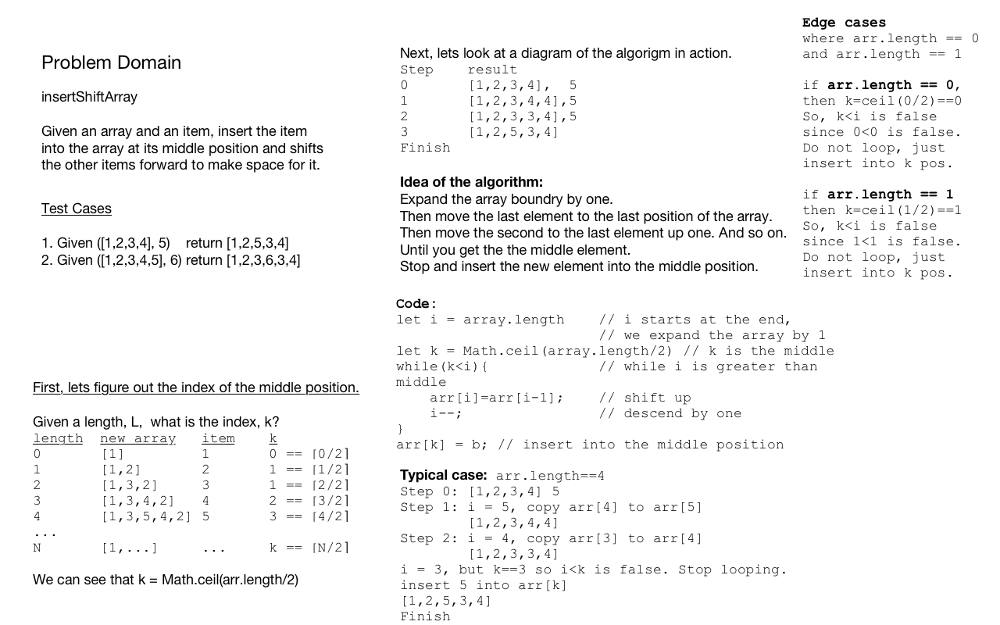

## Code for the Array Insert Shift function

Problem: insertShiftArray

Given an array and an item, insert the item into the array at its middle position and shifts the other items forward to make space for it.

Example:

arr = [1,2,3,4]
b = 5
insertShiftArray(arr, b)
Now arr is [1,2,5,3,4]

First, lets figure out the index of the middle position.

Given a length, L,  what is the index, k?
length  new array   item    k
0       [1]         1       0
1       [1,2]       2       1
2       [1,3,2]     3       1
3       [1,3,4,2]   4       2
4       [1,3,5,4,2] 5       3

We can see that k = Math.ceil(arr.length)

Next, lets look at a diagram of the algorigm in action.
Step    result
0       [1,2,3,4],  5
1       [1,2,3,4,4],5 
2       [1,2,3,3,4],5
3       [1,2,5,3,4]
Finish

Discussion: Expand the array boundry by one.
Then move the last element to the last position of the array.
Then move the second to the last element up one. And so on.
Until you get the the middle element.
Stop and insert the new element into the middle position.

Code:
let i = array.length    // i starts at the end, we expand the array by 1
let k = Math.ceil(array.length/2) // k is the middle
while(k<i){             // while i is greater than middle
    arr[i]=arr[i-1];    // shift up
    i--;                // descend by one
}
arr[k] = b; // insert into the middle position

Edge cases where arr.length == 0 and arr.length == 1
if arr.length == 0, then k = ceil(0/2) == 0
    So, k<i is false since 0< 0is false. Do not loop, just insert into k pos.
if arr.length ==1 then k = ceil(1/2) == 1
    So, k<i is false since 1<1 is false. Do not loop, just insert into k pos.

Typical case: arr.length==4
[1,2,3,4] 5
i = 5, copy arr[4] to arr[5]
[1,2,3,4,4]
i = 4, copy arr[3] to arr[4]
[1,2,3,3,4] 
i = 3, but k==3 so i<k is false. Stop looping.
insert 5 into arr[k]
[1,2,5,3,4]
Finish
