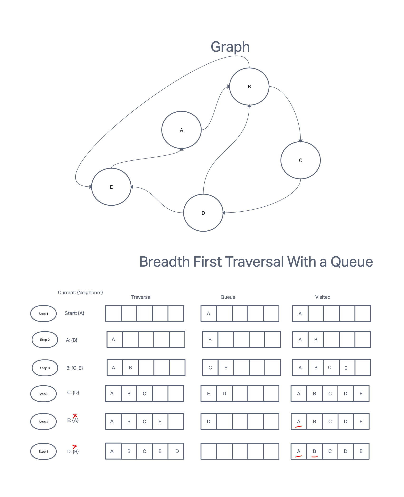

# Breadth First Traversal

A breadth first traversal of a graph visits every vertex in a graph once and traverses vertices that are closer to the start before vertices that are farther away. It is like a ripple moving from one point out the the edges.

A breadth first traversal of a graph will use a queue to keep track of which vertex to visit next, and a list of visited vertices to avoid visiting those a second time, in case of a cycle.

## Diagram

This diagram shows the steps involved in traversing the graph.

## Complexity

The algorithm must visit every node once, so it is at least O(V), where V is the number of vertices. It must also explore each edge of each node it visits, which takes O(E) time, where E is the number of edges. It must also check the list to see if each node has already been visited. If we use a hash table instead of a list, each lookup will take O(1) time and must occur for each edge explored, which will also take O(E). So the time complexity is O(E+V). If the graph is too large for the hash table, then we will have to account for its growth.
