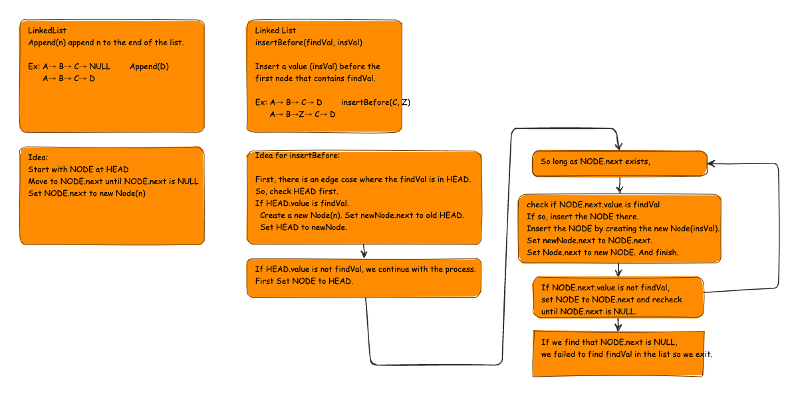

# Summary

Create a linked list with append, insertBefore, insertAfter methods.

## Whiteboard Process

## Approach & Efficiency

Each of the methods use a traversal starting from Head, which is an O(n) operation. Insertion itself, after finding the node/location is two operations, so it is O(1).

## Run through and examples

Let's try it out with the following list.

A -> B -> C -> D-> NULL

Let's append Z to the end.

First start at head. Let's set NODE to HEAD.

*NODE is A*

Next check if NODE is at the end. (Does it have a non-null next property?)

*NODE.next is Node(B)*

Then set NODE to Node.next.

*NODE is B*

Continue this until NODE.next is NULL

*NODE.next is NULL, NODE is NODE(D)*

Set NODE.next to Node(Z) and stop with...

A -> B -> C -> D -> Z -> NULL

