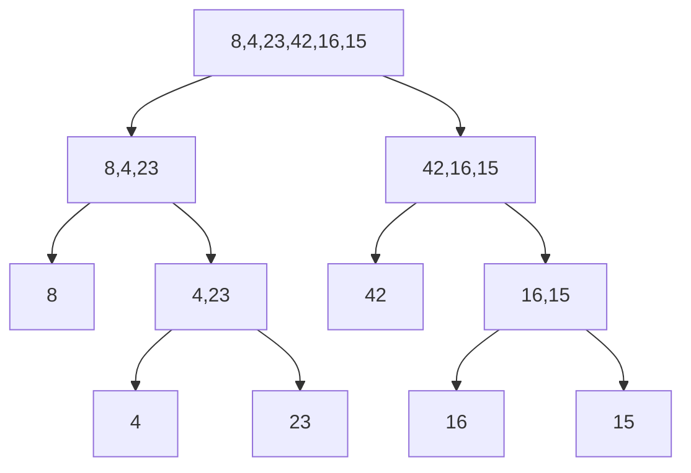
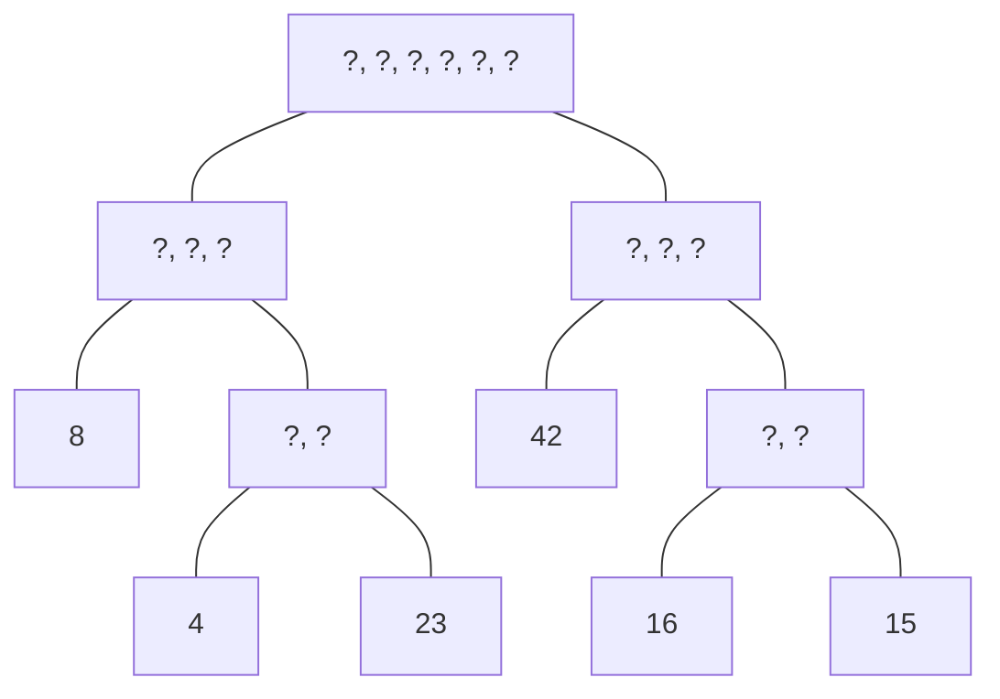
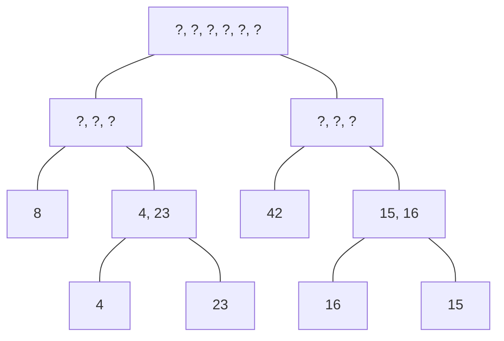
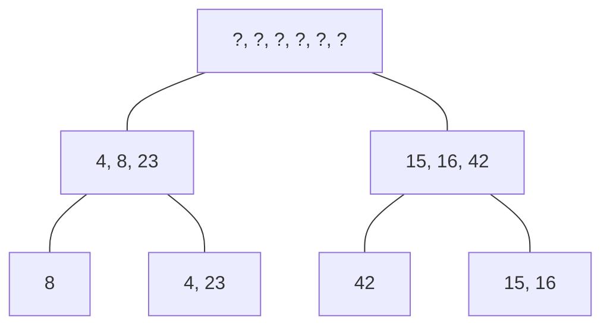
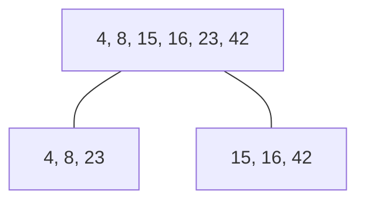

# Merge Sort.

## Idea of Algorithm

Merge sort is a recursive algorithm that divides the array in half, then sorts the array. An array of size 1 is already sorted. Then when each array is sorted, it merges the sorted sub-arrays until the entire array is sorted.

## Run through

Let's start with this example array.

    [ 8, 4, 23, 42, 16, 15 ]

The fist step is to divide each array in half. One way to visualize it is as a binary tree representing the call stacks of your recursive functions.

If you read the leaf nodes in order, they will spell out the array in its original order. They represent the terminal recursive function call.

After "going down" the recursive calls, we come "back up" the call stack and merge each list. Since each list "below" is already merged, the job is easier.

Merge step

Merge step

Merge step

Merge step

Each merge step is done by examining each element of the two arrays and placing the one with a lower value in the next available place in `arr`. So the number of operations for each merge step is 'm' where 'm' the the number of elements in both the arrays being merged at the time. Each level of the tree has a total of 'n' elements. We can see that the sum of all values for 'm' at each level is equal to 'n'. There are log(n) levels in the tree, so the combined running time for all the merge steps is O(n*log n).

Splitting the array in two and copying the values must be done once at each level of the tree, so that would take O(n*log n) time as well.

The space taken by the algorithm can be calculated by looking at the sized of the tree. Each level of the has n items. At the end of limit of the recursion step, there will be log n levels in the tree. So the space taken is O(n*log n).
