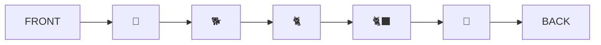
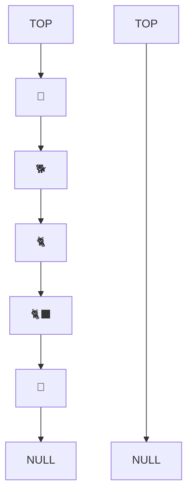

# Animal shelter queue with preferences

🐶,🐕,🦮,🐕‍🦺,🐩,🐺,🦊,🐈,🐱,😿,🙀,🐈‍⬛,🐆,🐯

## Challenge Summary

This animal shelter operates on a first in first out principle. But depending on the preference of the adopting customer, either a dog or cat will be selected. It could be implemented with two queues, one for dogs, and one for cats, but in this challenge, it should be implemented with a queue implemented with two stacks. This way it generalized to other preferences.

## Whiteboard Process

We can assume that our animals are in a queue.

If your preference is a dog, you can just take the dog from the front of the queue. But with a cat, you need to go the the third one in the queue.

So, let's arrange them as two stacks.

    HEAD2[TOP]-->AA["🐶"]-->BB["🐕"]-->CC["🐈"] --> DD["🐈‍⬛"]-->EE["🐯"] --> TAIL2[NULL]

## Approach & Efficiency

<!-- What approach did you take? Why? What is the Big O space/time for this approach? -->

## Solution

<!-- Show how to run your code, and examples of it in action -->

    dogs = [🐶,🐕,🦮,🐕‍🦺,🐩,🐺,🦊]

    cats = [🐈,🐱,😿,🙀,🐈‍⬛,🐆,🐯]
