# Animal shelter queue with preferences

🐶,🐕,🦮,🐕‍🦺,🐩,🐺,🦊,🐈,🐱,😿,🙀,🐈‍⬛,🐆,🐯

## Challenge Summary

This animal shelter operates on a first in first out principle. But depending on the preference of the adopting customer, either a dog or cat will be selected. It could be implemented with two queues, one for dogs, and one for cats, but in this challenge, it should be implemented with a stack and other data structure, which could be another stack, but I will use a linked list with push, pop, and enqueue methods.

## Whiteboard Process

We can assume that our animals are in a queue.

```mermaid
    graph LR

    HEAD --> A["🐶"] -->B["🐕"]-->C["🐈"] --> D["🐈‍⬛"]-->E["🐯"] --> TAIL

```

If your preference is a dog, you can just take the dog from the front of the queue. But with a cat, you need to go the the third one in the queue.

So, let's take them off and put them on a stack for a moment.

```mermaid

    graph
    HEAD[HEAD] --> A["🐶"] -->B["🐕"]-->C["🐈"] --> D["🐈‍⬛"]-->E["🐯"] --> TAIL

    HEAD2[TOP]------->TAIL2[NULL]
```

```mermaid
    graph
    HEAD[HEAD] -->C["🐈"] --> D["🐈‍⬛"]-->E["🐯"] --> TAIL

    HEAD2[TOP]-->B["🐕"]-->A["🐶"]--->TAIL2[NULL]
```

Now we can take the cat off of the queue.

```mermaid
    graph
    C["🐈"]
    HEAD[HEAD] --> D["🐈‍⬛"]-->E["🐯"] --> TAIL

    HEAD2[TOP]-->B["🐕"]-->A["🐶"]-->TAIL2[NULL]
```

Since our linked list has a push method, lets use the push method to put them back onto the linked list. We will pop from the stack, and push to the linked list.

```mermaid
    graph
    C["🐈"]
    HEAD[HEAD] -->A["🐶"]--> B["🐕"] --> D["🐈‍⬛"]-->E["🐯"] --> TAIL

    HEAD2[TOP]------>TAIL2[NULL]
```

Then they are all back in order again.

## Approach & Efficiency

The enqueue method is the same as that of the queue, which is O(1). Just put it on the tail and set the tail as tail.next

The dequeue method is best case O(1), if the element you prefer is on the top. Otherwise, you must dequeue each element off of the queue and push them onto the stack. You must do this until you find your prefered element. If the perfered element is on the back end of the queue, the operations will take O(n) time.

The space taken is O(1) for each operation.
