# Animal shelter queue with preferences

🐶,🐕,🦮,🐕‍🦺,🐩,🐺,🦊,🐈,🐱,😿,🙀,🐈‍⬛,🐆,🐯

## Challenge Summary

This animal shelter operates on a first in first out principle. But depending on the preference of the adopting customer, either a dog or cat will be selected. It could be implemented with two queues, one for dogs, and one for cats. But if the customer is picky, and has different preferences, we can pass in an arbitrary preference function to decide on an appropriate animal for adoption. In this case we can use three stacks. Two of the stacks will form a queue. A third stack will keep the unwanted animals during the selection process until an appropriate animal is found. For how two stacks can act as a queue, see [here](stack-queue-pseudo.md)

## Whiteboard Process

We can assume that our animals are in a queue.

```mermaid
    graph LR

    HEAD[FRONT] --> A["🐶"] -->B["🐕"]-->C["🐈"] --> D["🐈‍⬛"]-->E["🐯"] --> TAIL[BACK]

```

Let's create three stacks: backStack, frontStack, and tempStack. And we will push the animals from the queue onto the backStack.

```mermaid
    graph LR

    BACK_STACK[backStack] --> E["🐯"]--> D["🐈‍⬛"]-->C["🐈"] -->B["🐕"]-->A["🐶"] --> BACK_BACK_STACK[Bottom]
    FRONT_STACK[frontStack] -------> BACK_FRONT_STACK[Bottom]
    TEMP_STACK[tempStack] -------> BACK_TEMP_STACK[Bottom]

```

Let's say you want a dog. So let's put all the animals on the frontStack.

```mermaid

    graph LR

    BACK_STACK[backStack] -------> BACK_BACK_STACK[Bottom]
    FRONT_STACK[frontStack] --> A["🐶"] -->B["🐕"]-->C["🐈"] --> D["🐈‍⬛"]-->E["🐯"] --> FRONT_BACK_STACK[Bottom]
    TEMP_STACK[tempStack] -------> BACK_TEMP_STACK[Bottom]

```
Now we can take the dog off the top of the frontStack.

But, wait. Lets saw we wanted a cat. Let's put it back and try the same process with a cat instead. We will go back to the where the with all the animals were on the front stack.

Now we will take off the dog and put in on the tempStack.

```mermaid

    graph LR

    BACK_STACK[backStack] -------> BACK_BACK_STACK[Bottom]
    FRONT_STACK[frontStack] --->B["🐕"]-->C["🐈"] --> D["🐈‍⬛"]-->E["🐯"] --> FRONT_BACK_STACK[Bottom]
    TEMP_STACK[tempStack] ------> A["🐶"] --> BACK_TEMP_STACK[Bottom]

```

Now we can take the cat off of the frontStack.

```mermaid

    graph LR

    B["🐕 Adopted"]
    BACK_STACK[backStack] -------> BACK_BACK_STACK[Bottom]
    FRONT_STACK[frontStack] ---->C["🐈"] --> D["🐈‍⬛"]-->E["🐯"] --> FRONT_BACK_STACK[Bottom]
    TEMP_STACK[tempStack] ------> A["🐶"] --> BACK_TEMP_STACK[Bottom]

```

And, finally, we can put the dog back on the frontStack, keeping its place in line.

```mermaid

    graph LR

    B["🐕 Adopted"]
    BACK_STACK[backStack] -------> BACK_BACK_STACK[Bottom]
    FRONT_STACK[frontStack] ---> A["🐶"] -->C["🐈"] --> D["🐈‍⬛"]-->E["🐯"] --> FRONT_BACK_STACK[Bottom]
    TEMP_STACK[tempStack] -------> BACK_TEMP_STACK[Bottom]

```

## Enqueueing more animals

Let's say we want to add some more animals to the queue. 

Here are the incoming animals.

```mermaid

    graph LR

   front-->H["🦉"] --> G["🦜"] --> F["🐰"]-->back

```
We will put them on the back stack.

```mermaid

    graph LR

    BACK_STACK[backStack] ---> F["🐰"] --> G["🦜"] --> H["🦉"] --> ACK_BACK_STACK[Bottom]
    FRONT_STACK[frontStack] --> A["🐶"] -->C["🐈"] --> D["🐈‍⬛"]-->E["🐯"] --> FRONT_BACK_STACK[Bottom]
    TEMP_STACK[tempStack] ------> BACK_TEMP_STACK[Bottom]

```

We can adopt a dog, then a cat in the same way as before.

```mermaid

    graph LR

    A["🐶 Adopted"] 
    C["🐈 Adopted"] 

    BACK_STACK[backStack] --> F["🐰"] --> G["🦜"] --> H["🦉"] --> ACK_BACK_STACK[Bottom]
    FRONT_STACK[frontStack] ---> D["🐈‍⬛"]-->E["🐯"] --> FRONT_BACK_STACK[Bottom]
    TEMP_STACK[tempStack] -----> BACK_TEMP_STACK[Bottom]

```

But, now we want to adopt a parrot.

```mermaid

    graph LR

    BACK_STACK[backStack] --> F["🐰"] --> G["🦜"] --> H["🦉"] --> BACK_BACK_STACK[Bottom]
    FRONT_STACK[frontStack] ---> D["🐈‍⬛"]-->E["🐯"] --> FRONT_BACK_STACK[Bottom]
    TEMP_STACK[tempStack] -----> BACK_TEMP_STACK[Bottom]

```

We will check each animal on the front stack front stack. If it is not a parrot, we will put it on the tempStack.

```mermaid

    graph LR

    BACK_STACK[backStack] --> F["🐰"] --> G["🦜"] --> H["🦉"] --> BACK_BACK_STACK[Bottom]
    FRONT_STACK[frontStack] -----> FRONT_BACK_STACK[Bottom]
    TEMP_STACK[tempStack] ---> E["🐯"] --> D["🐈‍⬛"]--> BACK_TEMP_STACK[Bottom]

```
When the frontStack is empty, we will need to flip the backStack over by popping every element of the backStack and pushing it onto the frontStack. In the end, it will look like this.

```mermaid

    graph LR

    BACK_STACK[backStack] ----->    BACK_BACK_STACK[Bottom]
    FRONT_STACK[frontStack] --> H["🦉"] -->G["🦜"] -->F["🐰"] --> FRONT_BACK_STACK[Bottom]
    TEMP_STACK[tempStack] ---> E["🐯"] --> D["🐈‍⬛"]--> BACK_TEMP_STACK[Bottom]

```

We can now continue working on the frontStack until the parrot is on top.

```mermaid

    graph LR

    BACK_STACK[backStack] ----->    BACK_BACK_STACK[Bottom]
    FRONT_STACK[frontStack] ---> G["🦜"] -->F["🐰"] --> FRONT_BACK_STACK[Bottom]
    TEMP_STACK[tempStack] --> H["🦉"] --> E["🐯"] --> D["🐈‍⬛"]--> BACK_TEMP_STACK[Bottom]

```

We can adopt the parrot.

```mermaid

    graph LR
    G["🦜 Adopted"] 
    BACK_STACK[backStack] ----->    BACK_BACK_STACK[Bottom]
    FRONT_STACK[frontStack] ---->F["🐰"] --> FRONT_BACK_STACK[Bottom]
    TEMP_STACK[tempStack] --> H["🦉"] --> E["🐯"] --> D["🐈‍⬛"]--> BACK_TEMP_STACK[Bottom]

```

The push the other animals back. 

```mermaid

    graph LR
    G["🦜 Adopted"] 
    BACK_STACK[backStack] ------>    BACK_BACK_STACK[Bottom]
    FRONT_STACK[frontStack]  --> D["🐈‍⬛"] --> E["🐯"] --> H["🦉"] -->F["🐰"] --> FRONT_BACK_STACK[Bottom]
    TEMP_STACK[tempStack] ------>BACK_TEMP_STACK[Bottom]

```

They are all in the right order again.

## Approach & Efficiency

The enqueue method is the same as that of the queue, which is O(1). Just put it on the tail and set the tail as tail.next

The dequeue method is best case O(1), if the element you prefer is on the top. Otherwise, you must dequeue each element off of the queue and push them onto the stack. You must do this until you find your preferred element. If the preferred element is on the back end of the queue, the operations will take O(n) time because you will have to examine each element to see if it passes your preference criteria.

The space taken is O(1) for each operation since whenever you add an element to a stack, you take it off another stack.
