# Challenge Summary

A queue can be implemented with two stacks. Although it is not very effcient, it is an interesting exersize.

## Whiteboard Process

We will start with a frontStack and backStack. When we enqueue, we will push to the back stack.

Let's start with A, B and C and two empty stacks.

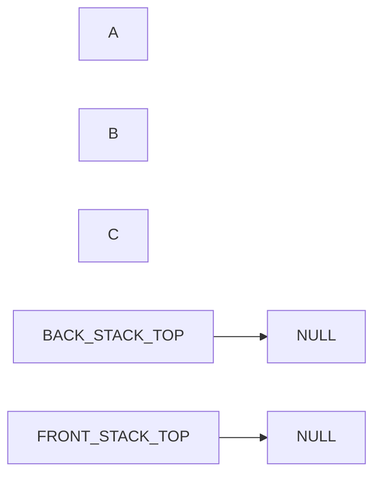

Let's put A, B and C on the back stack:

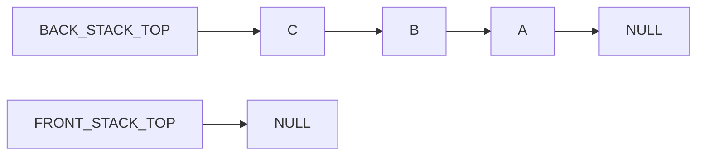

If we want to dequeue, we want to dequeue from the front stack. But first, we need to pop them each off the backStack and push them on the frontStack.

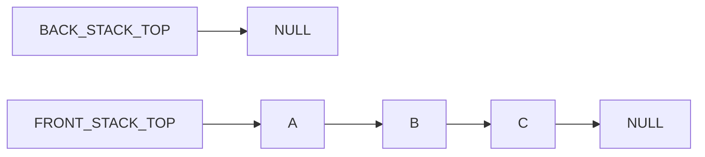

You can see, now A is on the top of the frontStack. If we pop the frontStack, we will get A, then B, then C.

Let's dequeue A from the queue.

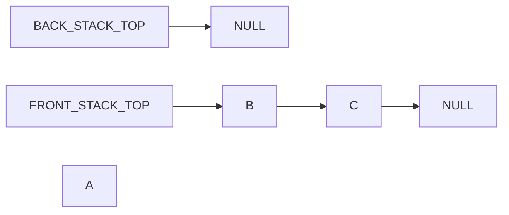

And lets add more items to the pseudo queue by pushing them to the back stack.

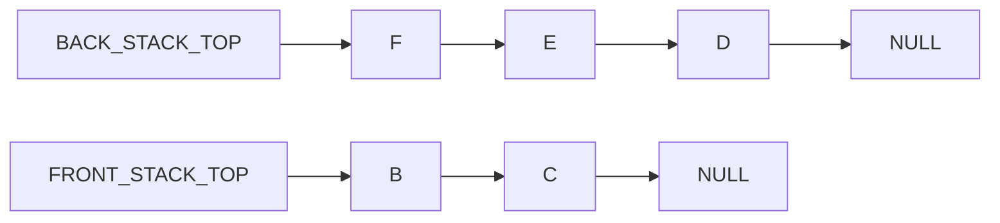

If we want to empty the queue, first we will pop from front stack until there are no more items. Like so:

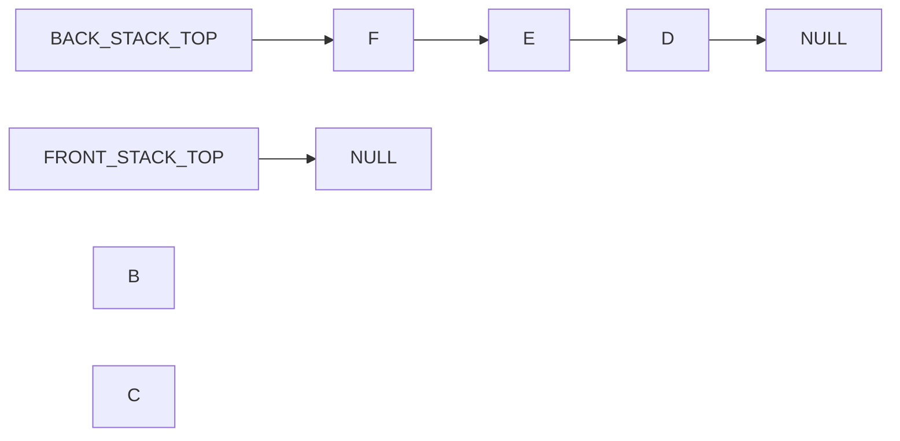

B and C come off in the order they were put on in.

Then, since the front queue is empty, we pop an element from the backStack, and push it on the frontStack

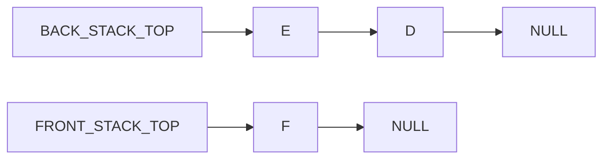

But, F is not next. D is next. We must pop, then push every item on the backStack before we do another dequeue.

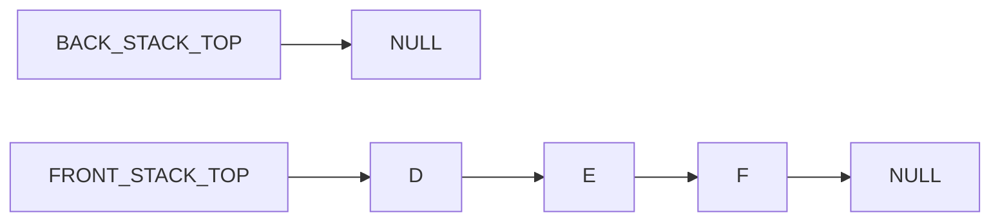

Now we can dequeue and get the next item, D.

## Approach & Efficiency

Enqueuing an item will be contant time and contstant space, because all we do when we enqueue an item is push it to the back stack.

Dequeueing will take O(1) in the best case and O(N) in the worst case. The worst case is if we enqueue N items on the stack, then dequeue. In this case all N of the items are on the back stack and all need to be moved to the front stack to be dequeued. In the best case, there will be an item in the front stack and we will just pop it from there.

## Solution

Enqueue is as simple as

    class Queue{
        ...
        enqueue(value) {
            this.stackBack.push(value);
        }
    }

We can enqueue a few times and get the following representation.

    queue = new Queue()
    queue.enqueue(A)
    queue.enqueue(B)
    queue.enqueue(C)

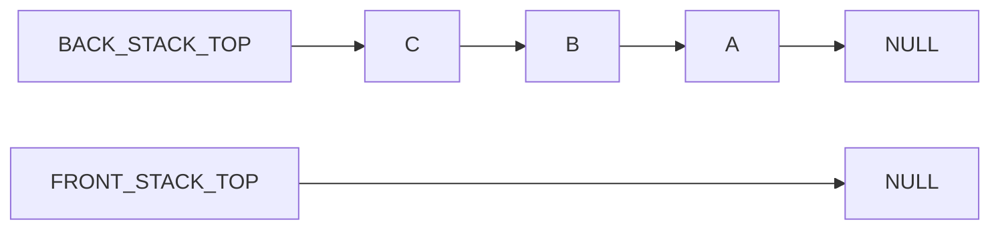

Dequeue is more complicated.

    dequeue() {
        if (!this.stackFront.isEmpty()) {
            return this.stackFront.pop();
        } else {
        while (!this.stackBack.isEmpty()) {
            this.stackFront.push(this.stackBack.pop());
        }
        return this.stackFront.pop();
    }

Since the front stack is empty, we have to dequeue all the items on the back stack first.

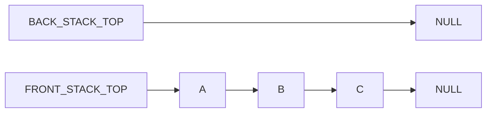

Then we can pop from the front stack.

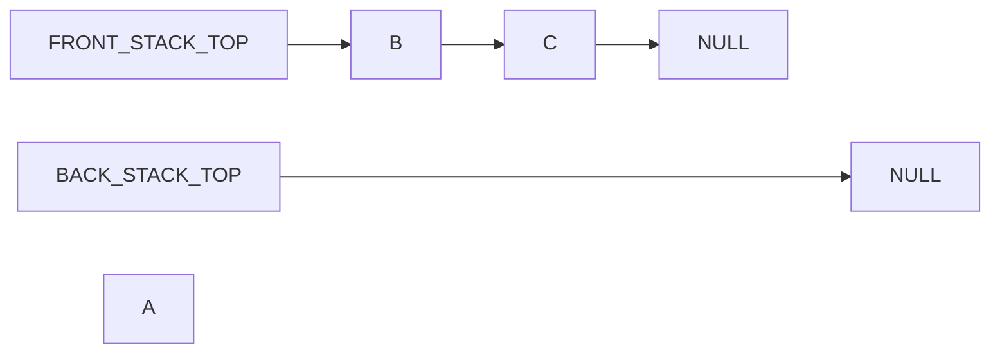

That took N pops and pushes, where N is the number of items that were in the back stack.

But if we want to dequeue again, it will only take one operation, namely `frontStack.pop()` because frontStack is not empty.

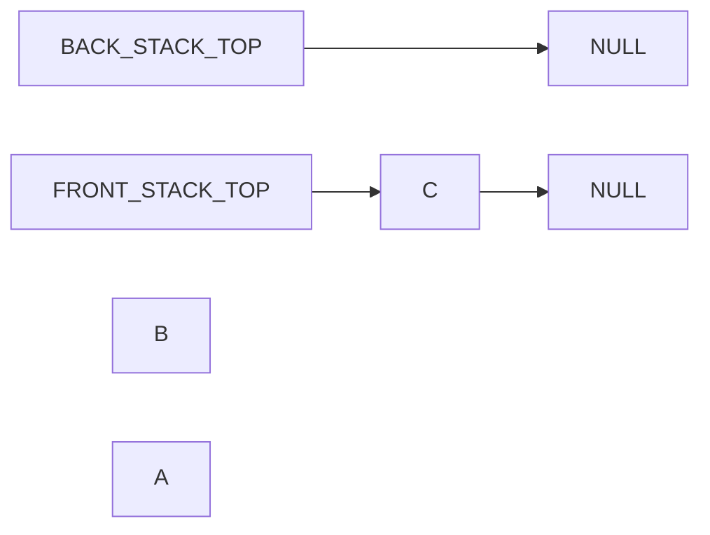

We can see in the worst case it was O(N) operations and the best case was O(1). In terms of space, operations are O(1) because we are not removing items in one stack as soon as we are creating them in another.
