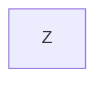

# Challenge Summary

A queue can be implemented with two stacks. Although it is not very effcient, it is an interesting exersize.

## Whiteboard Process

Imagine this stack with A at the top.

And this empty stack.

Let's say we want to add Z to the end of the stack.

First we pop from one stack, then push to the other for all items in the stack. (This will obviously take O(n) time.)

Then we push Z onto the first, now empty stack.

Then we pop, then push each item back onto the first stack.

This will take O(n) time, also.

So the total time taken will be O(2n) ~= O(n)

<!-- Embedded whiteboard image -->

## Approach & Efficiency

## Solution

<!-- Show how to run your code, and examples of it in action -->
