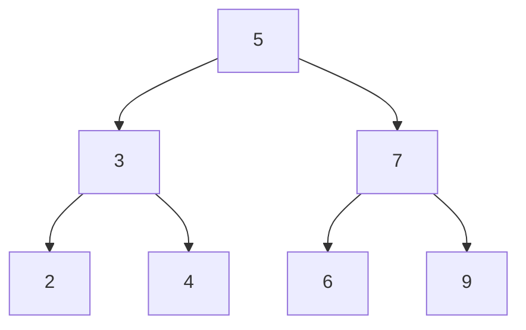
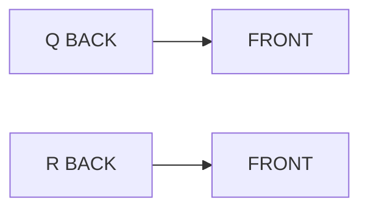
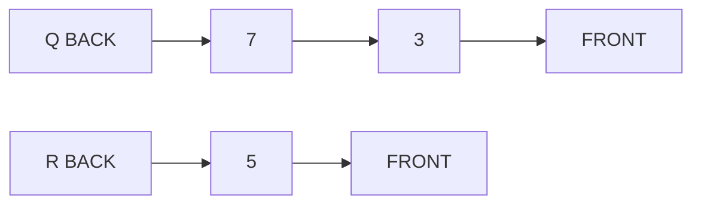
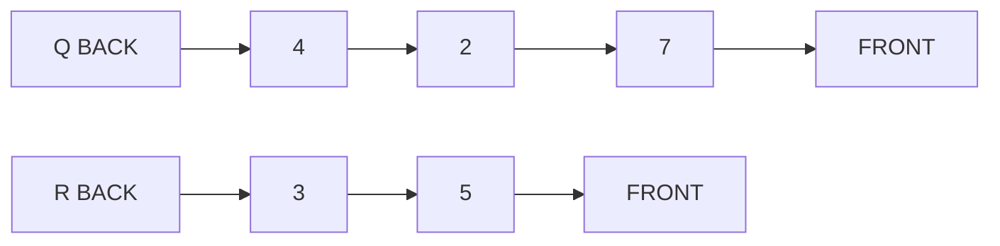
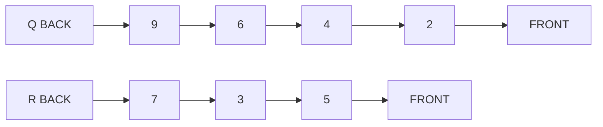
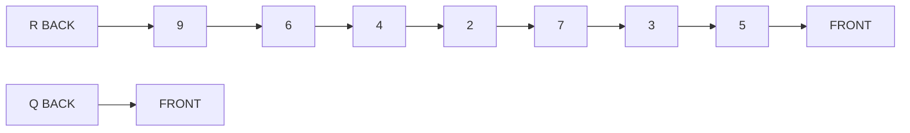

# Challenge

Breadth first traversal of a tree.

## Idea Implementation

While a depth first traversal of a tree can rely on the call stack to maintain the nodes to be traversed, a breadth first traversal requires a queue. 

The idea of the algorithm is to put each node onto a queue when it is encountered. Then, it will be dequeued and examined, and its children will be put on the queue. The children of the earlier nodes will be examined before the children of those children, and so on.

## Example

Suppose we had the following graph.

We need a queue, Q, and something to keep track of the traversal, say a queue R.

First, put 5 on Q. Then, take one off Q. That will be 5, itself since Q is of length 1 at this point. Then put the children of 5, on Q. The Q will look like this:

Now, take off 3, and put the children of 3 on Q.

Now, 7.

There are no more children, so there will be no more additions to Q. Let's finish by putting all the nodes from Q onto R.

This is a breadth first traversal of the tree.

