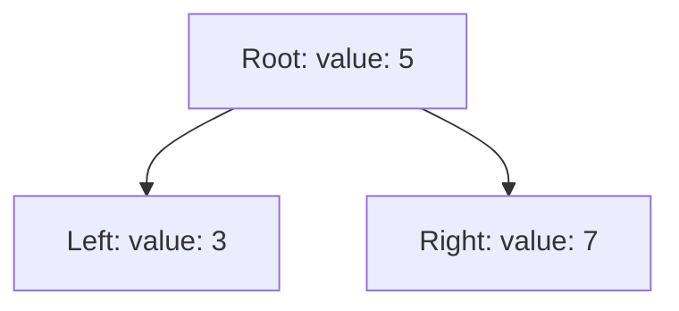
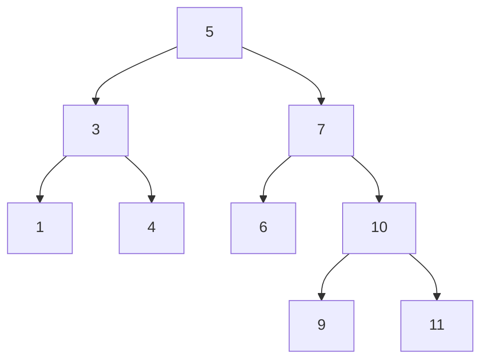
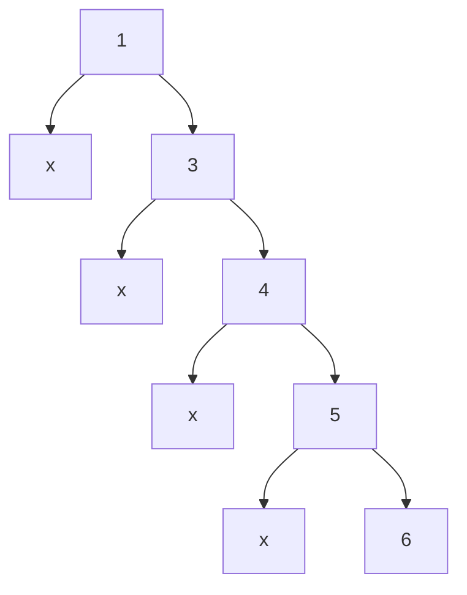
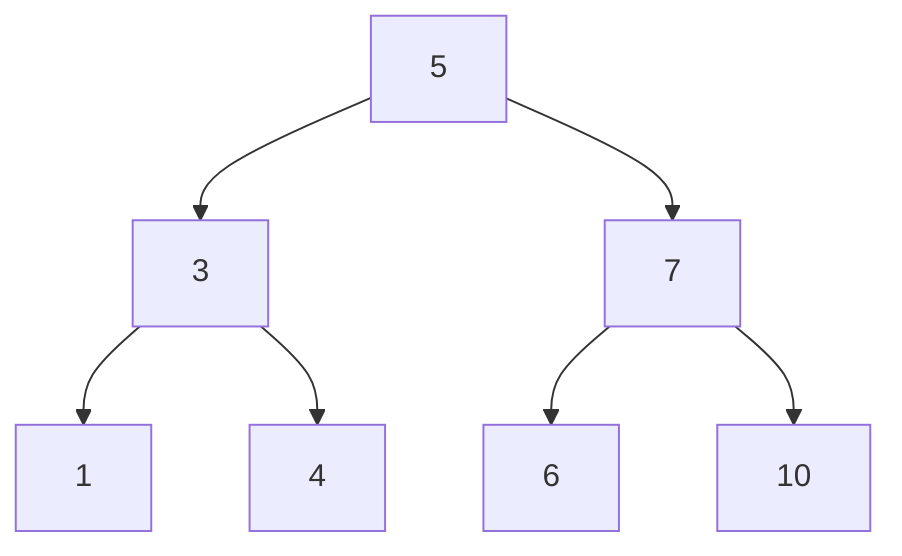

# Trees

A binary search tree (BST) is a collection of nodes containing a root node, where each node has a pointer to two nodes: one called left, and one called right. Further, each node has a value. The value of the left node must be less than the value of the parent node. The value of the right node must be greater than the value of the parent node.

## Challenge

Write and algorithm to find if the BST contains a given value.

For example, the following graph contains the value 10 but not the value 2.

## Approach & Efficiency

Idea: We will start at the top and move down a level, each time getting closer to the node containing our target value. We do this by checking our node's value. If the target value is greater, than the node's value, the target node must be on the right. If it is less, then we must look on the left branch. If it is equal, our node is the current node.

After moving right or left down the tree, we repeat the algorithm until the value is found, or the node has no child to move on to, in which case the value is missing from the tree.

The algorithm is worst case O(n) if the tree is unbalanced.

For example, searching for 6 will take O(n) time in the following graph.

However, searching for 10 in the following graph will only take O(log(n)) because the height of the tree is equal to the log base 2 of the number of nodes in a complete tree.

## API

To run this module, you can build a tree and check if it contains a value like this:

    const bst = BinarySearchTree()
    bst.add(5)
    bst.add(3)
    bst.add(7)
    bst.add(2)
    bst.contains(2) // == true
    bst.contains(1) // == false

The order of `add`ing items to the tree will affect the final height of the tree.
